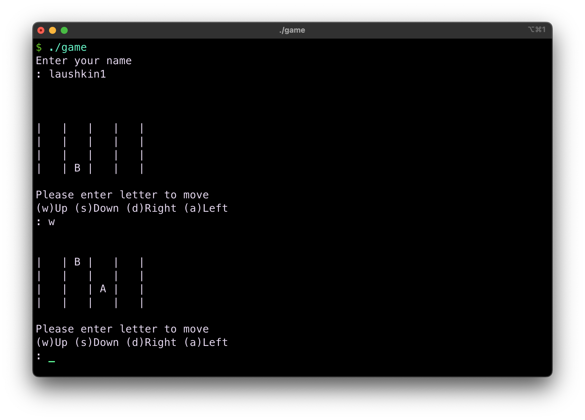
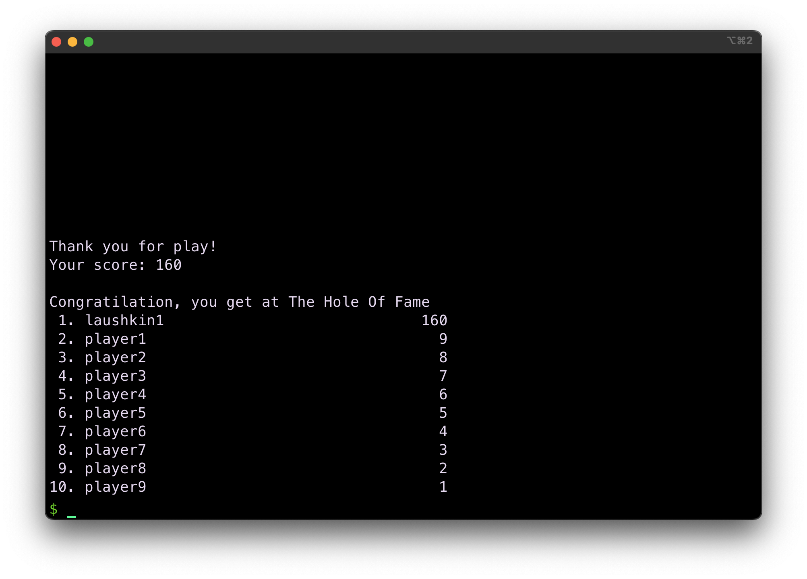

# K Game
Game K is based on 2048 and, like 2048, is played on a 4x4 field. The only difference between these games is the fact that in K you will use letters instead of numbers on the playing board. The player can move these tiles in four directions.

## Screenshots


<!---


-->

## How to use?
```bash
make
./game
```

## Control
`w` - Up\
`s` - Down\
`a` - Left\
`d` - Right\
`q` - Exit

## About Game
This game works without any additional libraries, and there is a Hall of Fame in the score file where the top 10 players are recorded. At the beginning of the game you must enter your name without spaces, the name must be less than 29 characters, at the end of the game, if your score is in the top 10 players, your name is recorded in the Hall of Fame.

